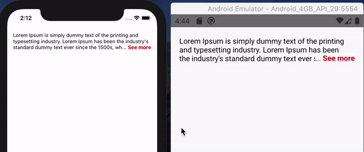

  

#### Please :star: it, thanks :thumbsup:
# react-native-read-more
React native library to show text in a condensed way and expand when needed. Can be used with native or expo on all platforms. Supports TS/JS both.



### Installation

```
npm i @fawazahmed/react-native-read-more --save
```

or with yarn

```
yarn add @fawazahmed/react-native-read-more
```

### Usage

```javascript

import React from 'react';
import {SafeAreaView, StyleSheet, View} from 'react-native';
import ReadMore from '@fawazahmed/react-native-read-more';

const Home = () => {
  return (
    <SafeAreaView style={styles.safe}>
      <View style={styles.root}>
        <ReadMore numberOfLines={3} style={styles.textStyle}>
          {
            "Lorem Ipsum is simply dummy text of the printing and typesetting industry. Lorem Ipsum has been the industry's standard dummy text ever since the 1500s, when an unknown printer took a galley of type and scrambled it to make a type specimen book. It has survived not only five centuries, but also the leap into electronic typesetting, remaining essentially unchanged. It was popularised in the 1960s with the release of Letraset sheets containing Lorem Ipsum passages, and more recently with desktop publishing software like Aldus PageMaker including versions of Lorem Ipsum."
          }
        </ReadMore>
      </View>
    </SafeAreaView>
  );
};

const styles = StyleSheet.create({
  safe: {
    flex: 1,
  },
  root: {
    flex: 1,
    padding: 16,
  },
  textStyle: {
    fontSize: 14,
  },
});

export default Home;

```

## Props

| Prop | Type | Required | Note |
|---|---|---|---|
| `style` | `object or array` | no | text style
| `seeMoreText` | `string` | no | defaults to `See more`
| `seeMoreStyle` | `object or array` | no | text style for `See more` text
| `seeLessText` | `string` | no | defaults to `See less`
| `seeLessStyle` | `object or array` | no | text style for `See less` text
| `ellipsis` | `string` | no | defaults to `...`
| `wrapperStyle` | `object or array` | no | style for wrapper `View`
| `numberOfLines` | `number` | no | defaults to `3`
| `animate` | `bool` | no | defaults to `true` => applies a subtle animation to see more and see less text, not the complete text itself
| `customTextComponent` | `React component` | no | defaults to `Text`
| `expandOnly` | `bool` | no | defaults to `false` => hide see less option similar to a linkedIn post
| `onExpand` | `func` | no | optional callback executed when expanded
| `onCollapse` | `func` | no | optional callback executed when collapsed
| `onReady` | `func` | no | optional callback executed when see more placement measurements are completed
| `seeMoreContainerStyleSecondary` | `object` | no | Incase of text overlap, pass { position: 'relative' } see [issue](https://github.com/fawaz-ahmed/react-native-read-more/issues/52) (not recommended)

Any additional props are passed down to underlying `Text` component.

# Usage with HTML
HTML rendering is not part of this package, but can be done easily with the help of any custom html to text library. For sample code, refer to this [issue](https://github.com/fawaz-ahmed/react-native-read-more/issues/55#issuecomment-1046941770)

# Run example
```
git clone https://github.com/fawaz-ahmed/react-native-read-more.git
cd react-native-read-more/example
yarn install # or npm install

# to run on iOS
yarn ios

#to run on android
yarn android
```

# Why another library ?
This module will calculate where to position `See more` and `See less` within the same paragraph instead of occupying another line. It is a drop-in replacement for `Text` component and you can control when to apply the see more functionality by configuring the `numberOfLines` prop. Moreover, you can also pass your own custom implementation of `Text` component like `ParsedText` ([sample code](https://github.com/fawaz-ahmed/react-native-read-more/issues/37#issuecomment-1047029209)) etc.

## Testing with Jest
Make sure to add `jest.useFakeTimers();` to your test file.
See [Stackoverflow post](https://stackoverflow.com/questions/50793885/referenceerror-you-are-trying-to-import-a-file-after-the-jest-environment-has) and [jest timer mocks](https://jestjs.io/docs/timer-mocks)

## Seeing issues or any feedback or feature suggest ?
Create an [issue](https://github.com/fawaz-ahmed/react-native-read-more/issues) with github.

## Troubleshooting
- If you observe `See more` shown always in android, pass prop `allowFontScaling={false}`, refer to this [issue](https://github.com/fawaz-ahmed/react-native-read-more/issues/17)
- If you have any nested components other than `Text`, refer to this [issue](https://github.com/fawaz-ahmed/react-native-read-more/issues/52)

### Known issues
`Android only` if `numberOfLines` with a value of `1` is passed down as a prop, text in android devices will overlap at the end of line. This is an issue in `react-native` where text from other lines concatenates into the first one even if we add `\n` to the first line, where the lines returned from `onTextLayout` indicates a different response.
To overcome this issue, use `numberOfLines` greater than `1`.
